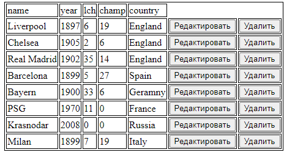

Посмотрите видео о том как работать с драйвером для подключения БД, используйте MySQL WorkBench, все выполняете как в лабораторной работе 3, только вместо файла сохраняете в БД. Должны быть все четыре элемента CRUD (create-read-update-delete).

### Основные условия выполнения
- Сформировать строку JSON
- Передать строку JSON на сервер
- Должно быть не менее 5 свойств у объекта (Например: Список студентов 1 - Имя, 2 - Фамилия,  3- группа, 4 - возраст,  5- изучаемый предмет)
- Дессериализовать в объект (POJO) строку json
- Записать полученную объект в файл на сервере
- Вернуть строки JSON с сервера
- Создать из строки JSON объект
- Получить список всех объектов хранящихся на сервере в файле (можно в виде таблицы, в виде карточек, в виде контейнеров и т.д.)

